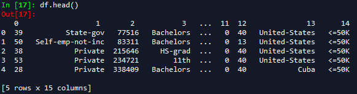
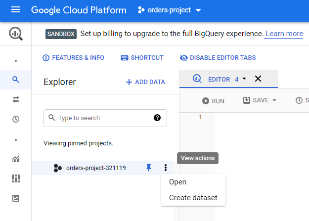
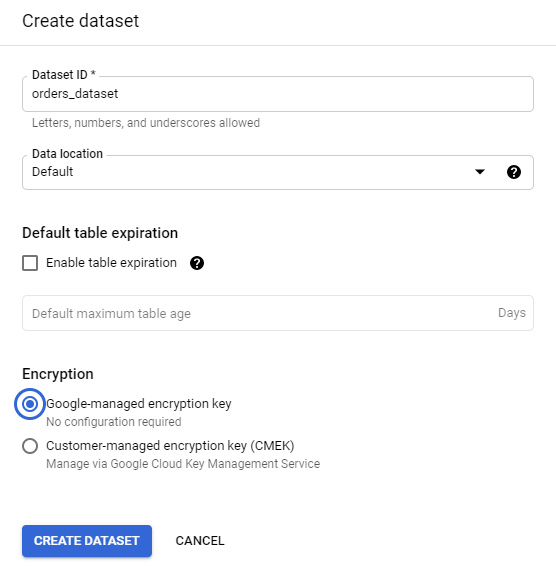
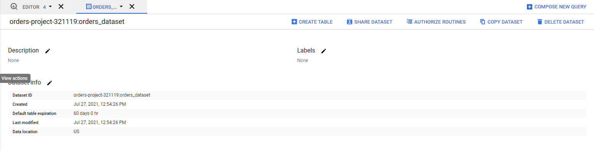
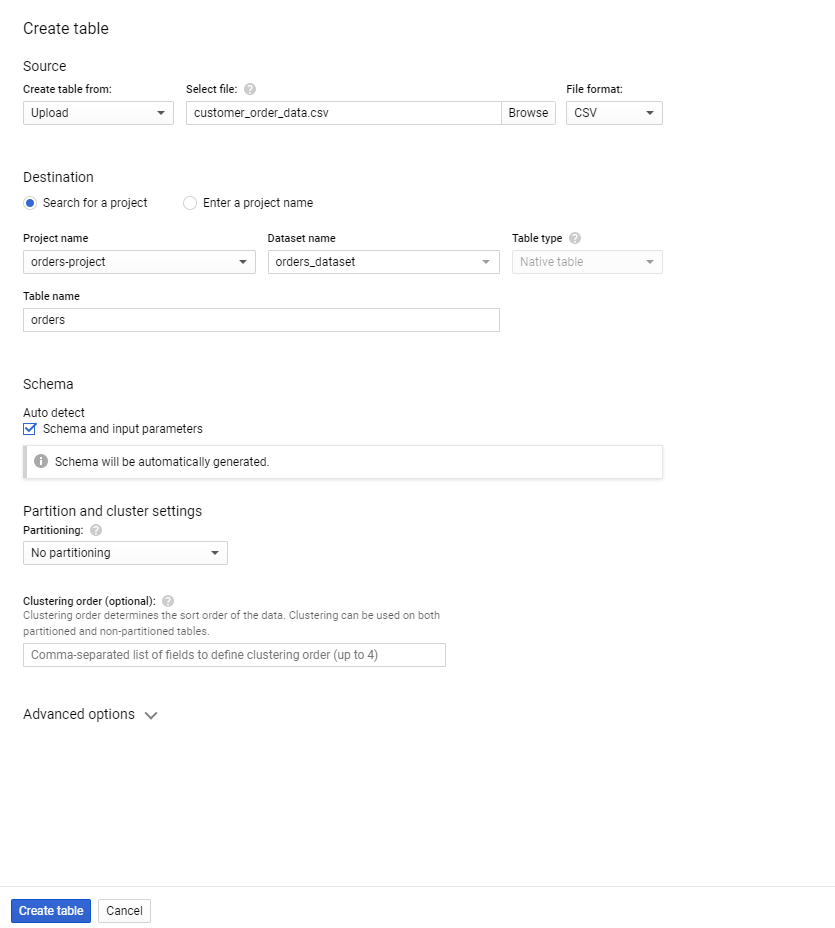
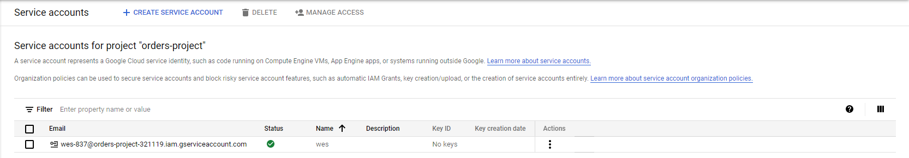

# Connecting to data sources with `pandas`

## Student Takeaways

By the end of this lesson, the student should know:

* How to load local data using pandas
* How to create tables in BigQuery
* How to generate access keys in BigQuery
* How to connect to and retrieve data from BigQuery using pandas

Here, we introduce the `pandas` package for working with data in Python. We've already seen _dataframes_ when we worked with Google sheets. The `pandas` package for Python allows us to work with dataframes in Python. By combining the general nature of Python with a package created to handle data, we vastly expand what we can do with our dataframes.  

## Getting started

Before using the package, let's make sure to import it.  

```python
import pandas as pd
```

We alias the `pandas` package by "pd" to make it a bit easier to work with. Now that we have the package at our disposal, we need some data!  

## Connecting to local data

We will explore two types of connections today: connections to local data (for instance, a .csv or .tsv file) and connections to datalakes (in our case, BigQuery). Connecting to local data tends to be easier — since these files are contained on your personal computer, there aren't any extra permissions to sort out.   

Let's start up Python (either via Jupyter Notebook, Spyder, or using the Python console) and grab the `adult.data` and `adult.names` file from the course notes repository (found [here](./assets/adult_census)). It will be easiest to place these in your working directory.  

To check current working directory in Spyder, in the built-in console, type ```ls``` and the current folder, along with its contents, will be displayed. 

In a notebook or the console, we can use the following code to check our current working directory:  

```python
import os  

os.getcwd()
```

Now that we have some data, let's open it using pandas. Pandas has built-in methods for opening different types of data, but the file we downloaded doesn't indicate how it is formatted. Unfortunately, as an analyst, it isn't uncommon to get files with strange endings and be expected to work with them! Let's try opening the file with a typical text editor (for instance, Notepad in Windows, TextEdit on Mac, or gedit on Linux) — with some inspection, we see that every row seems to have values separated by a comma. In other words, this is a comma-separated value (.csv) file. Pandas has a method called ```read_csv``` to seamlessly import .csv files. In Python, let's type the following:

```python
import pandas as pd #if you haven't already  

df = pd.read_csv("./assets/adult_census/adult.data")
```

The variable `df` now contains all of the data from the file. `df` is a `pandas.DataFrame` object, which means it comes with some useful methods to help us explore and operate on its data. Let's use the `df.head()` command to display the first five rows of the data.  


Something is a little off here. It looks like we've printed out six rows, but really, pandas thought the first row was the column names (it looks like our file doesn't have any column names). We'll work on adding columns later, but for now, we can simply pass in the `header=None` argument into the `read_csv` function to tell pandas that the file has no headers.

```python
df = pd.read_csv("./assets/adult_census/adult.data", header=None)
```

Now when we try running `df.head()`, we see the desired output. Pandas defaults to simply numbering the columns.



Many other file types exist, such as tab-separated, fixed-width, or JSON files. Pandas has input/output methods for many different file formats, which can be explored [here](https://pandas.pydata.org/pandas-docs/stable/user_guide/io.html).

## Connecting to datalakes

Connecting to datalakes is a little more complicated, since we generally need to communicate that we have permissions to access the data in question. This is typically accomplished via _keys_. In the SQL portion of the course, we used BigQuery to look into some data. We'll make use of BigQuery again, but this time, we'll connect to it in Python, and pull data into Python from the comfort of our notebook (or console, depending on what you're using). 

### Creating a table in BigQuery

First, let's grab the `customer_order_data.csv` from the module repository [here](./assets/order_data) and upload it to BigQuery. We'll create a new project and then under that project, create a dataset:



The name for the dataset doesn't have to be fancy, as long as you can remember it!



Once the dataset itself is created, we'll use the `Create Table` button to create a table:



Indicate that the table will be created from an upload, give it a name, and select `Auto detect` under `Schema`. 



### Generating access keys

Next, we need to generate access keys, to show the BigQuery API that we have permission to access the data we'll be asking for. Google has a [very helpful page](https://cloud.google.com/bigquery/docs/reference/libraries) about doing this, but we'll briefly go through it here as well. 

First, we need to make sure we have the proper Python packages. Let's run the following command in the Anaconda prompt.

```python
pip install pyarrow
pip install --upgrade google-cloud-bigquery
```

Second, navigate [to this link](https://console.cloud.google.com/projectselector/iam-admin/serviceaccounts/create?supportedpurview=project&_ga=2.19061695.605584465.1627406036-1368752313.1627406036) and select the project we just created. Enter a name in the `Service account name` field, and optionally add a description. Click `Create`. 

Next, in the `Select a role` field, select `Owner` (under 'Quick Access>Basic'). Click `Continue` and then click `Done`. **DON'T CLOSE THIS TAB!**

The next step is to generate the key. You should see something like this:



Under `Actions`, go to `Manage Keys` and under `ADD KEY`, select `Create new key`. In the pop-up window, select `JSON` and press create. The key will be automatically saved to your computer. You can rename it to something simpler to make the next step easier. 

The final step is to create an _environment variable_ that points the BigQuery API to where your key is. The commands to do this vary depending on your machine. Open up a terminal window (for Windows users, this is sometimes called a _command prompt_), and type:

**Windows**
```
set GOOGLE_APPLICATION_CREDENTIALS=PATH/TO/MY/KEYNAME.json
```

**Linux/MacOS**
```
export GOOGLE_APPLICATION_CREDENTIALS="PATH/TO/MY/KEYNAME.json"
```

**NOTE:**

 You must use ```GOOGLE_APPLICATION_CREDENTIALS``` as the environment variable name. The BigQuery API automatically looks for this variable to find the access key. 

If the above commands did not work, we can also set environment variables through Python:

```python
import os

os.environ['GOOGLE_APPLICATION_CREDENTIALS'] = 'PATH/TO/MY/KEYNAME.json'
```

### Querying for data with BigQuery

Now that we've set everything up, let's use the BigQuery API to access the table we created in BigQuery. We'll use a SQL query as usual, but this time, we'll create it as a string variable in Python, and pass it as an argument to a `query` method. 

```python
import time
from google.cloud import bigquery

query = "select * from orders_dataset.orders"

client = bigquery.Client()
query_job = client.query(query)

time.sleep(2) #give the query some time to finish
result = query_job.result()

df = result.to_dataframe()
df.head(10)
```

If you got an error about pyarrow not being installed, make sure you ran the `pip install` commands with administrator permissions. For now, instead of using the `df = result.to_dataframe()` command, try using this code:

```python
rows = []
for row in result:
	rows.append(row)

columns = list(rows[0].keys())
rows = [ele.values() for ele in rows]

df = pd.DataFrame(rows, columns=columns)
```

### Connecting and querying other datalakes

There are many data providers, and (roughly) equally as many APIs that can be used to connect to them. However, the access key method is generally followed among most APIs (sometimes with more keys), so the process should always look vaguely similar. Remember, whenever in doubt, you can read the documentation for an API you want to use. 

## Recap

We covered how to load data using pandas, both locally and using datalakes. Loading data is the universal entrypoint of every analysis using Python, so keep these steps in mind!
