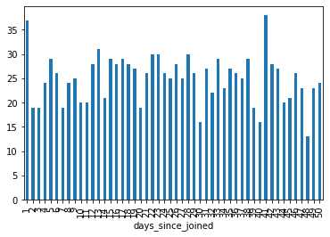
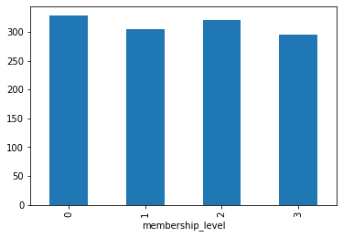
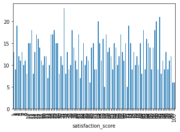
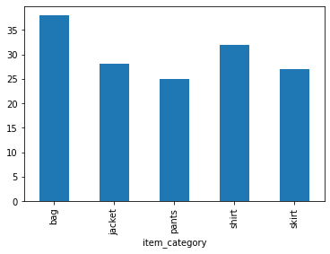

# Data analysis with Pandas

## Learning objectives

By the end of this lesson, you should know:

 * How to aggregate data meaningfully to produce insights
 * How to use built-in plotting methods to guide analysis
 * How to ask meaningful questions about a given dataset

## What is data analysis?

Before we start analyzing data, we should probably know what data analysis is. Generally, every dataset contains some information that can be used to answer various questions. Data analysis is the process of using tools, such as aggregations, statistics, visualizations, and the like to draw out information from a dataset. Because every dataset is so different, the process and end result of data analyses varies greatly. For instance, some data analyses are performed entirely in Tableau, with the deliverable being a live dashboard. Other analyses are more exploratory in nature, with the goal of producing some quick visualizations and aggregate data to give the analyst an idea of what to do next. 

While this lack of process may seem daunting, it also keeps analyses fun — every dataset comes with its own interesting questions and problems to solve. Also, while the analysis process may differ between datasets, the tools or functions we use tend to be pretty standard. Herein, we'll go through common tools and processes used in a data analysis, all while working with simulated customer data. 

## Analyzing customer data

You've been hired by a fledgling fashion company as a data analyst. While you're waiting on access to their databases, a data engineer has kindly given you CSVs of some of their tables (available [here](./assets/fashion_company_data.zip?raw=true)). Your boss, not knowing what sorts of insights you can extract from the data, has simply asked you to perform an analysis. Let's go over the possible avenues you could take, and what sorts of tools you might use. 

### Step 1: Exploratory data analysis

The first step of any analysis will (almost) always be getting familiar with the data. You need to know your data in order to know what sorts of questions you can answer with it, or how you can use it! Getting familiar with your data will also raise relevant questions that you can investigate, as well as show the limitations of the data. With this in mind, let's begin by loading in our data and taking a look at the first few rows. Since we're working with multiple tables, we should use descriptive names so that any code we write is easy to understand.

```python
import pandas as pd

customer_info = pd.read_csv('customer_data.csv')
item_info = pd.read_csv('item_data.csv')
purchase_history = pd.read_csv('purchase_data.csv')

print(customer_info.head())
print(item_info.head())
print(purchase_history.head())
```

```
                        customer_id  ... satisfaction_score
0  960b2366e6be4f9da662ba578bc82b30  ...                 23
1  3238d579b84b4700ab792207614e6096  ...                 72
2  2b32bd19399a49e0bde35e4f7e08cc19  ...                 16
3  3599e5843d494b0fb00fab308059b8d4  ...                 32
4  3707f9f5a14b47b5be865afdeb3544b0  ...                 93

[5 rows x 7 columns]
   item_id  sku colour
0  jacket0    0  GREEN
1   shirt0    1   PINK
2   pants0    2  WHITE
3     bag0    3  WHITE
4   pants1    4  GREEN
                        customer_id  day     item
0  960b2366e6be4f9da662ba578bc82b30   24  pants13
1  960b2366e6be4f9da662ba578bc82b30   36   skirt5
2  960b2366e6be4f9da662ba578bc82b30   29  skirt14
3  960b2366e6be4f9da662ba578bc82b30   48    bag30
4  960b2366e6be4f9da662ba578bc82b30   13  pants18
```

Both the item and purchase information are small dataframes, with only three columns. Let's look at the columns in the customer table, as well as one row, so we can get a better idea of what it contains. 

```python
print(customer_info.columns)
print(customer_info.iloc[0, :])
```

```
Index(['customer_id', 'location', 'days_since_joined', 'joined_on_sale',
       'email_subscription', 'membership_level', 'satisfaction_score'],
      dtype='object')

customer_id           960b2366e6be4f9da662ba578bc82b30
location                                          ASIA
days_since_joined                                   41
joined_on_sale                                       1
email_subscription                                   0
membership_level                                     1
satisfaction_score                                  23
Name: 0, dtype: object
```

From the customers table, we get an overview of each customer, with information tied to their unique identification number. We have location (which appears to be continent-based), how many days they've been a customer, and information relating to when they joined, if they are subscribed to an email list, their membership level, and their satisfaction score. Let's try to get a bit more information on these fields, since looking at one row doesn't give us enough information. 

In an [earlier code-along](../data_manipulation/code_alongs/Missing_Values_Code_Along_(Student).ipynb), we saw how to use the `groupby` method in conjunction with Pandas built-in plotting method. We're going to revisit this fully so that we can make good use of it in our exploratory analysis. 

The `groupby` method aggregates our data based on a column (or list of columns we put in). Aggregation alone doesn't really do anything for us — we need to make use of the aggregate levels by also providing a function. This is a pattern we've actually seen before! Remember that in SQL, whenever we use a function like `COUNT` or `AVERAGE`, we also need to include `GROUP BY` near the end of the query. In Pandas, the order is reversed — we first call the `groupby` method, with a column or list of columns to aggregate, and then another method like `size` or `mean`. The call in general looks like `dataframe.groupby('column').aggregate_method()`. Documentation on every aggregate method that can be called can be found [here](https://pandas.pydata.org/pandas-docs/stable/reference/groupby.html), but we'll focus on ones used for calculating summary statistics or counts, since they are used most frequently.

Let's begin by grouping some of the columns above and looking at their `size` (this is like the SQL `COUNT` function, returning how many times each unique element in a given column appears).

```python
customer_info.groupby('location').size()
```

```
location
AFRICA      326
AMERICAS    316
ASIA        282
EUROPE      326
dtype: int64
```

It looks like location is somewhat nonstandard, with both North and South America being combined, and some continents not showing up. While the aggregated data is readable for a small number of unique values, if we had ten or more locations, we would be quickly overloaded with data. Fortunately, we can use the Pandas built-in plotting method to produce quick visualizations — though these aren't report-ready (we'll cover producing beautiful visualizations in a future lesson). We simply add `.plot(kind='bar')` to call the plotting method, and specify we want to make a bar-plot for the aggregated values. Let's use this in conjunction with `days_since_joined`.

```python
customer_info.groupby('days_since_joined').size().plot(kind='bar')
```



The values look as if they're spread out uniformly — the mark of a steady (albeit new) business. From the plot, we can see that the oldest customer is just 50 days old, while for some customers, they joined just a day ago. Let's check the mean and median customer ages. 

```python
print(customer_info['days_since_joined'].mean())
print(customer_info['days_since_joined'].median())
```

```
25.1552
25.0
```

They're very similar! This leads us to believe even more that the number of customers joining each day is distributed uniformly, meaning that approximately the same number of customers join each day, without any growth or decay in the number of joiners per day over time. This in itself is already a useful piece of information we can provide in a report. We could also propose monitoring daily new customers to detect when the amount of new customers changes (and potentially investigate why those changes occurred). 

Next, let's aggregate on `joined_on_sale` and determine whether more customers join when the business is having a sale or not. 

```python 
customer_info.groupby('joined_on_sale').size()
```

```
joined_on_sale
0    627
1    623
dtype: int64
```

It seems like sales don't bring in more additional new customers than normal. This could mean several different things: sales might be oriented towards existing customers, the sale itself isn't getting enough exposure, the business itself is too small to hold effective sales, etc. Importantly, just by getting familiar with our data, we're raising important follow-ups that can be fully explained in a technical report. 

Let's aggregate and plot both `membership_level` and `satisfaction_score`. 

```python
customer_info.groupby('membership_level').size().plot(kind='bar')
customer_info.groupby('satisfaction_score').size().plot(kind='bar')
```



It seems like there are four different membership levels, each of which seems to be about the same size. 



This plot is a bit messier, since values for `satisfaction_score` range from 1–100. Nevertheless, we see a similar trend: evenly distributed across the possible range of values. 

Next, let's look at the `item_info` table. It contains a row for each unique item. The `sku` field might seem a bit weird, but with a bit of searching, `sku` denotes _stock keeping unit_, which is just a unique number to track inventory. It looks like a unique `item_id` is created for each item, following the pattern `type_of_item + number`. Let's see how the item types are distributed. We'll create a new column based on `item_id`, but strip off the number. Next, we'll group by this new column, count the group sizes, and plot the result.

Now that we have our game plan, let's think a bit more about how to strip off the trailing nubmers. We want to strip off every numeric character from a string, but the problem is that the number of numeric characters can vary string by string. For example, we might have `pants0` and `pants14`, so we can't just say `x[:-1]` or `x[:-2]`. Fortunately, strings come with a method called `isalpha`, which returns true if the string or character is alphabetical, and false otherwise. Let's use this to build a function that will strip off the number from our strings and return them. We'll apply this to the `item_id` column of our dataframe. 

```python
def remove_number_from_item_id(item_id):
  # get just the alphabetic characters in a list
  non_numeric_characters = [character for character in item_id if character.isalpha()]  
  # combine the list back together into a string
  return ''.join(non_numeric_characters)

item_info['item_category'] = item_info['item_id'].apply(remove_number_from_item_id)
item_info.groupby('item_category').size().plot(kind='bar')
```
We could also do this a little more succinctly using a lambda function,
```python
item_info['item_category'] = item_info['item_id'].apply(lambda x: ''.join(char for char in x if char.isalpha()))
item_info.groupby('item_category').size().plot(kind='bar')
```



It looks like we have roughly the same amount of items per category, with more bags than any other item. Maybe this is because bags are easier to produce and represent a higher profit margin. It looks like we don't have enough data to investigate this hypothesis, though, since we don't have any data on production cost and price. 

Finally, let's take a look at the `purchase_history` data. This is simply a record of the purchases made each day. Let's look at the number of purchases per day. As usual, we'll make a plot for clarity.

```python
purchase_history.groupby('day').size().plot(kind='bar')
```


This is exactly what we would hope to see for a growing business! This would be good data to produce in a nice chart and use in a presentation — everyone likes good news (so long as it's relevant). At this point, we might want to request data on profit per item. If we had this data, we could produce a quick report on daily profit, and maybe look into forecasting future earnings. 

We've made a decent exploratory analysis of the data. Note that some analyses stop here — familiarizing oneself with the data, seeing some patterns, and answering some basic questions is enough for some analysis tasks. However, we'll go one step further. Our next step is to formulate a meaningful question (or questions) that we can answer with our data. 

### Step 2: Formulating a good question

Now that we have some idea of the variables and the information they contain, what can we do? Well, it seems like a lot of the business questions we could ask relate to what drives customers to make purchases. For most businesses, profits guide decisions about what items to release, or to what types of people marketing efforts are aimed.

However, we need to ensure we ask a question to which we can provide an answer. We don't have any data that lets us calculate profit, but we do have a good proxy: the number of sales! Thus, let's investigate the number of sales. But can we investigate it in relation to anything? We have only 1250 customers, and about 10000 sales. In the world of data, this is actually quite small. Therefore, we have to carefully design our question so it is tractable — that is, we can expect to get a reasonable answer to our question based on our data. Let's investigate whether other variables influence the number of purchases a customer makes.

For example, are there any variables in the `customer_info` table that give us a good idea as to whether a customer will make multiple purchases? Here, our focus isn't on predicting the number of purchases, but identifying relevant variables. If this sounds familiar, that's because it is! We looked at using regression modelling in conjunction with hypothesis testing in a [previous lesson](../../statistics/statistics_with_python.md). We'll make use of the same techniques to answer this question. 

For now, let's formulate our question, so we have a clear idea of what we want to answer:

**Are there variables in the item and customer tables that are linked with the number of purchases a customer makes?**

### Step 3: Answering our question

In formulating our question, we also gave ourselves hints as to how we might answer it. We want to investigate how certain variables affect the number of purchases a customer makes. That is, we want to determine which variables are good predictors of purchase count! This sounds like a linear regression problem. We can use linear regression modelling to determine variables that are good predictors for number of purchases. But first, we need to massage our data into a format such that it is ready for regression modelling. 

Let's think about what our data needs to look like. For every supervised modelling task, recall that we need a label (a dependent variable), as well as one or more predictor (independent) variables. Our label will be the number of purchases a customer has made. Therefore, we'll have one row per customer. This row should also include all the relevant customer information from the `customer_info` table. This sounds like a good use-case for a `join`! But first, let's aggregate the purchase information. 

```python
agg_purchase = purchase_history.groupby('customer_id').size().to_frame()
agg_purchase.columns = ['num_purchases']
```

Now that we have the aggregated information, let's use `pd.merge` to join this and the `customer_info` table together:

```python
model_frame = pd.merge(agg_purchase, customer_info, how='inner', left_index=True, right_on='customer_id')
```

We saw the `pd.merge` function in a previous lesson, but [here is the documentation](https://pandas.pydata.org/pandas-docs/stable/reference/api/pandas.merge.html) in case you need a refresher. We specify that we're joining the left frame (`agg_purchase`) on its index, and we're joining the right frame on the column `customer_id`. 

Now, let's import the `statsmodels` library we used for linear regression, add the constant column for intercept and separate our variables, and put them into the model. 

```python
import numpy as np
import statsmodels.api as sm

model_frame['intercept'] = np.ones((model_frame.shape[0],))

dependent_vars = model_frame.iloc[:, 0]
independent_vars = model_frame.iloc[:, 1:]
```

Now, we know that linear regression handles only numeric data, but we have the `location` column, which is certainly not numeric! How can we handle this? The answer is with _dummy variables_. Let's consider a simpler case, where we have two locations: `EAST` and `WEST`. One fix might be to map `EAST` to 0 and `WEST` to 1. However, could we generalize this in a way that makes sense with regression? For example, with three locations, we would map them to values 0, 1, and 2. But we are imposing an ordering among these locations — if our regression model thinks that `location` is important, then the dependent variable will increase or decrease **based on the ordering we arbitrarily chose**. This is the last thing we want. Instead, we could create a column called `EAST` and a column called `WEST` and add a 1 in the `EAST` column and a 0 in the `WEST` column if the location is `EAST`, and the opposite for `WEST`. This method can generalize to more cases by adding more columns, and there is no ordering on the variables! This method is known as _one-hot encoding_! See the figure below for a visual depiction:


It probably won't surprise you by now to hear that Pandas has a convenient function for us to use: `pd.get_dummies` (documentation [here](https://pandas.pydata.org/pandas-docs/stable/reference/api/pandas.get_dummies.html)). Let's use it with the `location` column, and attach it to the `independent_vars` frame:

```python
location_encoded = pd.get_dummies(independent_vars['location'])
independent_vars = pd.concat([independent_vars, location_encoded], axis=1)
```

Great! Now we can drop the `customer_id` column (since we don't want to include the IDs in a model anyways) and the `location` column (since it has been replaced with the encoded columns. 

```python
independent_vars.drop(columns=['customer_id', 'location'], inplace=True)
```

Before we create our regression model, we should set our level of significance. We'll use the standard 0.05 (recall that the p-values from our regression model must be less than this value for us to accept them as significant contributors to the model). Finally, let's create our regression model and check the output:

```python
lin_reg = sm.OLS(dependent_vars, independent_vars)
reg_results = lin_reg.fit()
print(reg_results.summary())
```

```
                            OLS Regression Results                            
==============================================================================
Dep. Variable:          num_purchases   R-squared:                       0.757
Model:                            OLS   Adj. R-squared:                  0.755
Method:                 Least Squares   F-statistic:                     482.9
Date:                Wed, 25 Aug 2021   Prob (F-statistic):               0.00
Time:                        10:46:44   Log-Likelihood:                -2290.7
No. Observations:                1250   AIC:                             4599.
Df Residuals:                    1241   BIC:                             4645.
Df Model:                           8                                         
Covariance Type:            nonrobust                                         
======================================================================================
                         coef    std err          t      P>|t|      [0.025      0.975]
————————————————————————————–
days_since_joined      0.1214      0.003     39.897      0.000       0.115       0.127
joined_on_sale        -0.0796      0.086     -0.926      0.355      -0.248       0.089
email_subscription     0.6874      0.086      7.989      0.000       0.519       0.856
membership_level       0.7259      0.038     18.861      0.000       0.650       0.801
satisfaction_score     0.0606      0.002     40.222      0.000       0.058       0.064
intercept              0.4390      0.113      3.881      0.000       0.217       0.661
AFRICA                -0.1951      0.079     -2.466      0.014      -0.350      -0.040
AMERICAS               0.1414      0.079      1.789      0.074      -0.014       0.296
ASIA                   0.3734      0.083      4.517      0.000       0.211       0.536
EUROPE                 0.1192      0.078      1.527      0.127      -0.034       0.272
==============================================================================
Omnibus:                        0.144   Durbin-Watson:                   1.942
Prob(Omnibus):                  0.930   Jarque-Bera (JB):                0.191
Skew:                          -0.022   Prob(JB):                        0.909
Kurtosis:                       2.958   Cond. No.                     3.16e+17
==============================================================================

Warnings:
[1] Standard Errors assume that the covariance matrix of the errors is correctly specified.
[2] The smallest eigenvalue is 4.81e-29. This might indicate that there are
strong multicollinearity problems or that the design matrix is singular.
```

We notice that the regression model is significant (remember, this is the `Prob (F-statistic):` value in the first section of the table). Next, we look at the coefficients in our model. Interestingly, most of them are significant. As we suspected, the insignificant columns seem to be `joined_on_sale`, `AMERICAS`, and `EUROPE`. Remembering that the removal of one column can affect the significance level of others, let's begin by removing `joined_on_sale`:

```python
independent_vars2 = independent_vars.drop(columns=['joined_on_sale'])
lin_reg2 = sm.OLS(dependent_vars, independent_vars2)
regression_results2 = lin_reg2.fit()
print(regression_results2.summary())
```

```
                            OLS Regression Results                            
==============================================================================
Dep. Variable:          num_purchases   R-squared:                       0.757
Model:                            OLS   Adj. R-squared:                  0.755
Method:                 Least Squares   F-statistic:                     551.9
Date:                Wed, 25 Aug 2021   Prob (F-statistic):               0.00
Time:                        10:51:59   Log-Likelihood:                -2291.1
No. Observations:                1250   AIC:                             4598.
Df Residuals:                    1242   BIC:                             4639.
Df Model:                           7                                         
Covariance Type:            nonrobust                                         
======================================================================================
                         coef    std err          t      P>|t|      [0.025      0.975]
————————————————————————————–
days_since_joined      0.1214      0.003     39.927      0.000       0.115       0.127
email_subscription     0.6861      0.086      7.975      0.000       0.517       0.855
membership_level       0.7258      0.038     18.861      0.000       0.650       0.801
satisfaction_score     0.0607      0.002     40.309      0.000       0.058       0.064
intercept              0.4041      0.107      3.789      0.000       0.195       0.613
AFRICA                -0.2040      0.079     -2.597      0.010      -0.358      -0.050
AMERICAS               0.1326      0.078      1.690      0.091      -0.021       0.287
ASIA                   0.3649      0.082      4.441      0.000       0.204       0.526
EUROPE                 0.1106      0.078      1.427      0.154      -0.041       0.263
==============================================================================
Omnibus:                        0.115   Durbin-Watson:                   1.944
Prob(Omnibus):                  0.944   Jarque-Bera (JB):                0.156
Skew:                          -0.020   Prob(JB):                        0.925
Kurtosis:                       2.963   Cond. No.                     2.43e+17
==============================================================================

Warnings:
[1] Standard Errors assume that the covariance matrix of the errors is correctly specified.
[2] The smallest eigenvalue is 8.14e-29. This might indicate that there are
strong multicollinearity problems or that the design matrix is singular.
```

We have similar results: all coefficients are significant except now `AMERICAS` and `EUROPE`. Let's remove both of these and check our results once more:

```python
independent_vars3 = independent_vars2.drop(columns=['AMERICAS', 'EUROPE'])
lin_reg3 = sm.OLS(dependent_vars, independent_vars3)
regression_results3 = lin_reg3.fit()
print(regression_results3.summary())
```

```
                            OLS Regression Results                            
==============================================================================
Dep. Variable:          num_purchases   R-squared:                       0.757
Model:                            OLS   Adj. R-squared:                  0.756
Method:                 Least Squares   F-statistic:                     644.4
Date:                Wed, 25 Aug 2021   Prob (F-statistic):               0.00
Time:                        10:54:11   Log-Likelihood:                -2291.1
No. Observations:                1250   AIC:                             4596.
Df Residuals:                    1243   BIC:                             4632.
Df Model:                           6                                         
Covariance Type:            nonrobust                                         
======================================================================================
                         coef    std err          t      P>|t|      [0.025      0.975]
————————————————————————————–
days_since_joined      0.1214      0.003     39.942      0.000       0.115       0.127
email_subscription     0.6864      0.086      7.985      0.000       0.518       0.855
membership_level       0.7259      0.038     18.869      0.000       0.650       0.801
satisfaction_score     0.0607      0.002     40.325      0.000       0.058       0.064
intercept              0.5254      0.139      3.788      0.000       0.253       0.798
AFRICA                -0.3254      0.103     -3.150      0.002      -0.528      -0.123
ASIA                   0.2435      0.109      2.243      0.025       0.031       0.457
==============================================================================
Omnibus:                        0.118   Durbin-Watson:                   1.944
Prob(Omnibus):                  0.943   Jarque-Bera (JB):                0.158
Skew:                          -0.021   Prob(JB):                        0.924
Kurtosis:                       2.963   Cond. No.                         219.
==============================================================================

Warnings:
[1] Standard Errors assume that the covariance matrix of the errors is correctly specified.
```

The above looks great! The regression model is simpler, and each coefficient is significant. 

Let's think a little bit more about why `EUROPE` and `AMERICAS` were insignificant. The dependent variable, `num_purchases`, can either increase or decrease. This increase or decrease can be captured with two coefficients: `AFRICA` and `ASIA`. If `EUROPE` and `AMERICAS` had the same purchasing behaviour, then this can be captured in the `intercept` coefficient, and other regional information is controlled fully by `AFRICA` and `ASIA`. This may or may not be the case, but we can check our data:

```python
model_frame.groupby('location').mean()['num_purchases']
```

```
location
AFRICA      7.763804
AMERICAS    7.977848
ASIA        8.280142
EUROPE      7.978528
Name: num_purchases, dtype: float64
```

It seems our intuition is correct. `EUROPE` and `AMERICAS` have extremely similar purchase behaviour, which differs from both `AFRICA` and `ASIA`. This highlights an important fact: though we chose a tool (regression) to answer a question, different tools (in this case, summary statistics) can provide additional information and highlight other factors. In general, though a certain tool will be best-suited to answer a question, on its own, it won't provide a complete answer! Data analysis is interesting because we can highlight different aspects of questions or answers to questions with various tools — there is no single process that is best-suited to all analyses. 

So, what is our conclusion? Let's look at each of the coefficients and try to formulate a take-home for each:

 * `days_since_joined` is significant, so the business should try to retain customers in order to stimulate more purchases.
 * `email_subscription` is significant, so the business should offer incentives for subscribing to an email list.
 * `membership_level` is significant, so the business could explore promotional offers on memberships.
 * `satisfaction_score` is significant, so the business should seek customer feedback to see how they can improve.
 * `location` (`AFRICA`, `ASIA`) is significant. The business should make sure its advertising methods suit the countries in which they are deployed. 
 
Coming up with conclusions or suggestions like these is also a bit of an art. Try coming up with some of your own — the above is by no means exhaustive!

### Step 4: Communicating our results

Now that we've answered our question, we need to be able to communicate our results effectively. While technical writing could comprise an entire bootcamp in and of itself, we'll focus on what we need to consider when writing and presenting our results. 

#### Determine your audience

The first step in communicating your results is determining your audience. Are your results being delivered to experts in your field? Then you should give a report that includes the relevant technical details (`satisfaction_score` is significant with a p-value of < 0.001 in a linear regression model with an R2 score of 0.757). Are your results going to a busy executive? Then include only the relevant information, without miring them in jargon (the customer's satisfaction survey score is an important factor in how many purchases they will make). 

If the report is going to be circulated, with various audiences, then add sections relevant to each audience. An _executive summary_ can give a quick report on the conclusions and recommended next steps, suitable for a busy executive; while an appendix on the statistical modelling and results might be more relevant to the subject matter experts.

#### Clear writing

No matter who your audience is, you should strive for your writing to be clear and to the point. Everyone has responsibilities to fulfill, and reading your report might not be high on their list. Therefore, make it as easy as possible in order to engage each reader and increase their likelihood of making it all the way through. 

When communicating in a technical document, be sure to use an active voice ("We analyzed how _X_ affects _Y_" rather than "An analysis was made on the effects of _X_ on _Y_"). Passive voice is often converted to active voice (did you convert that sentence?), so spare your readers the mental processing time. Active voice is also shorter and to the point. 

Include clearly labelled figures where appropriate. A figure with a representative title and good labels will save you a lot of words. If your figure is poorly labelled, it could raise more questions than answers.

Code and technical material should usually be relegated to an appendix or technical details section if the document is going to be distributed to multiple audiences. 

Remember that a good analytics report is often a catalyst for action. The answers that you discover to important questions won't be acted on if you can't communicate your results! 

More details on technical writing can be found [in this excellent course by Google](https://developers.google.com/tech-writing/overview). 

## Exercise

Now that you've seen the analysis process, it's time for you to do an analysis of your own! [This site](https://archive-beta.ics.uci.edu/) has hundreds of open-source datasets. Find some data that piques your interest, and perform an analysis, answering whatever question you find interesting. 

The open-ended nature of this exercise might seem daunting, but know that you're encouraged to find a dataset you're interested in, and answer a question close to your heart. It's usually easiest to work on problems we care about. Nevertheless, if you're overwhelmed by the weight of your freedom, here are some good datasets and questions to ask:

 * [Wine dataset](https://archive-beta.ics.uci.edu/ml/datasets/109) — what makes a wine high quality? Are there strong correlations between wine quality and any of the other variables?
 * [Car price dataset](https://archive-beta.ics.uci.edu/ml/datasets/19) — what determines car price? Can we use regression to determine significant variables?
 * [Iris flower dataset](https://archive-beta.ics.uci.edu/ml/datasets/53) — Perform an exploratory analysis. How are sepal with and length, and petal width and length related? 
