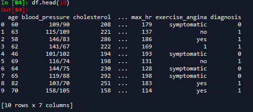

# Data Manipulation with Pandas: Part II

## Student Takeaways

By the end of this lesson, the student should know:

* How to approach the data cleaning and preparing process
* How to convert unstructured to structured data
* How to write custom functions and dictionaries to format data
* How to separate data into multiple columns
* How to add or remove columns from a dataframe
* How to pad values

Let's expand what we can do to manipulate data with pandas! This time around, we'll take a look at more involved methods: instead of taking slices of data or calculating some fairly basic measures, we'll modify, clean, and add on to the data we already have. 

Let's begin by taking a look at our first dataset, `heart_disease.log`. The `.log` ending is slightly ambiguous! Usually, log files are just text, so it can be opened in your default text editor. 

```txt
60,109/90BREAK208BREAKbidbenazeprilBREAK0BREAK179BREAKsymptomaticBREAK0
63	115/109	221,ST-T wave abnormalityBREAK137,bidapixaban||clopidogrel	no,1
58BREAKbiddabigatran||clopidogrel||apixaban||benazepril||dipyridamole	146/83,286BREAK0	186,yes,1
bidbenazepril||dabigatran||clopidogrel||dipyridamole||apixabanBREAK62BREAK141/67,222,0BREAK169,1BREAK1
46,101/102,194,left ventricular hypertrophy,bidbenazepril||clopidogrel||dipyridamole||dabigatranBREAK193,symptomaticBREAK0
biddipyridamole||clopidogrel||dabigatran||apixabanBREAK69,116/74BREAK198	left ventricular hypertrophy	131BREAKnoBREAK1
64BREAKbiddipyridamole||dabigatran||apixabanBREAK144/75	230BREAKleft ventricular hypertrophyBREAK128,symptomatic,0
65,biddipyridamole	119/88BREAK292	left ventricular hypertrophyBREAK198BREAKsymptomatic,0
82	103/70	bidapixaban||clopidogrel||dabigatran||benazepril||dipyridamole,251	ST-T wave abnormality	
...
```

The figure above shows the first few lines of our dataset. It looks extremely messy. We have our work cut out for us! It is especially important to look at metadata (wherever it is available) when working with messy data. It can be a first step in making sense of what we're seeing, by pointing out what might be otherwise unclear structure. The metadata can be found in the ```heart_disease.metadata``` file, but it is reproduced below:

```txt
This dataset is based loosely on the UCI Heart Disease dataset. 
It is comprised of a set of dirty lines from medical log data containing patient information as well as a diagnosis of heart disease. Columns follow a semi-standard format of

 1. patient age
 2. blood pressure at time of admission to hospital (in mmHg)
 3. cholesterol at time of admission to hospital (in mg/dL)
 4. rest heart rate diagnosis (0 for normal, ST-T wave abnormality, or left ventricular hypertrophy)
 5. maximum heart achieved
 6. exercise-induced angina
 7. diagnosis (angiographic disease status. 0: < 50% diameter narrowing, 1: > 50% diameter narrowing)

Besides these columns, there is a prescription line detailing what the patient took at various points, which, due to a machine error, has been inserted randomly between the typical columns. Nonstandard reporting mechanisms mean that each field separator is nonstandard as well.

Prediction task: Predict the presence or absence of heart disease.
```

The metadata explains why we see some structural abnormality. Medication information has been inserted at random due to a machine error, and the separators are not standardized, again due to a machine error. Once we know this information, coupled with the typical ordering of columns, we start to see patterns. 

1. It looks like we have three separators: `\t`, `,`, `BREAK`.
1. The medication column always starts with "bid" and then a list of medications separated by `||`. 

## The cleaning and preparing process

Dealing with messy data is common. In fact, an [old article](https://www.forbes.com/sites/gilpress/2016/03/23/data-preparation-most-time-consuming-least-enjoyable-data-science-task-survey-says/?sh=79cb2a416f63) estimates that as much as 80% of a data scientist's time is spent cleaning and preparing data! Cleaning and preparing data is an invaluable skill across data analyst, data scientist, and machine learning engineer roles. 

The first thing we need to decide is our goal: what should the data look like by the end of the process? This goal is determined by how the data will be used. In our case, let's prepare it for the prediction task mentioned in the metadata — we want to predict whether the given patient has heart disease or not. Therefore, our end goal is to reformat the given log data into a dataframe, with numeric or categorical values for easier computations. 

Let's load our data into Python:

```python
with open('./assets/heart_disease/heart_disease.log', 'r') as f:
	lines = f.readlines()
```

### Choosing what to do first

When there's a lot to do, it's easy to come face-to-face with decision paralysis. Ideally, we would like to minimize the overall effort we have to put into cleaning and preparing data. While we don't know what this will actually be in advance, we might be able to get a good idea of what needs tending to first. For example, in the heart disease data, the medication line seems to be the most abnormal — it is inserted randomly between all other columns. If we were to remove this line, then we would at least be working with a file that has some regular structure to it.

This sort of approach to optimization is known as a _greedy optimization strategy_: we do what looks best to us in the moment, without thinking too far ahead. It can sound a bit silly at first, but this is an extremely common optimization strategy in the artificial intelligence/machine learning domain (for instance, some [gradient descent methods](https://en.wikipedia.org/wiki/Gradient_descent), [maximization of modularity in a network](https://www.pnas.org/content/103/23/8577), etc.). 

### Dealing with the medication data

With this greedy strategy in mind, let's work on extracting the medication information from the log data. There are a few different ways of doing this, but we'll take this opportunity to introduce an extremely powerful way of searching strings: _Regular Expressions_, or regex for short. A regular expression is a sequence of characters that specifies a pattern to search for in a string. 

**NOTE:** 

You are not required to know regex as part of this course. However, it is an extremely powerful tool, and one you will almost surely encounter or use working as a data analyst, so we introduce it here. A very good tutorial, complete with exercises, can be found [here](https://regexone.com/). 

We want to identify global patterns that exist in the medication data, then translate these to regex, in order to capture exactly the patient medications. Let's think about the patterns we can identify in the medication string:

 1. Each string begins with "bid" — looking up medical abbreviations, it looks like this means "take twice a day."
 1. Each medication is typed in lower case letters, and, in the case of multiple medications, separated by `||`. 
 1. Each medication string ends with one of the three separators we identified above.
 1. Each patient seems to have a medication line (this may not turn out to be the case, but let's work with this assumption for now. 

Translated into regex, this looks like:

```regex
(?<=bid)[a-z|]+([,\s]|BREAK)
```

This expression tells the interpreter to look for a string immediately following the characters `bid` that,
* starts with at least one or more of either: 
    * a lower-case alphabetical character between `a` and `z` 
    * or a `|` symbol, 
* followed by either:
    * one of: a comma `,` or any  whitespace character `\s`
    * Or the characters `BREAK`

We just have to figure out how to work with regular expressions in Python. Fortunately, Python has a library for it, called ```re```, with documentation [here](https://docs.python.org/3/library/re.html).

Let's begin by importing the library:

```python
import re
```

It looks like we only need basic functionality: the `re` library contains a function called `search`, which takes two arguments:

1. A regular expression that specifies a pattern we'll search for in a string
1. The string in which we want to search for the pattern

Let's write a function that takes a line from our list, `lines`, and returns the medication string, as well as the modified line without the medication string.


```python
def string_split(line):
    match = re.search('(?<=bid)[a-z|]+([,\s]|BREAK)', line)
    medication = match.group(0) # the matched medication string is contained in the 0th group of the overall match
    match_position = match.span() # a tuple with the start and end positions of the matched string
    cut_start = match_position[0] - 3 # get the positon at the start of `bid`
    cut_end = match_position[1]
    line_without_medication = line[:cut_start] + line[cut_end:]
    return medication, line_without_medication 
```

This is great, but we need to alter our regular expression to return multiple _capture groups_. We'll add an extra set of parentheses, so that we can tell our match object to return different groups with the `group` method — the first group will contain only the medication string, without the ending.

```python
def string_split(line):
	match = re.search('(?<=bid)([a-z\|]+)([,\s]|BREAK)', line)
	medication = match.group(1) #get the first capture group 
	match_position = match.span() #this is the integer locations of matched string
	cut_start = match_position[0] - 3
	cut_end = match_position[1]
	line_without_medication = line[:cut_start] + line[cut_end:]
	return medication, line_without_medication
```

This function can be applied to each individual line in a list, so now let's make a function that takes in our entire list of lines, and gives us back two lists: one containing the medications string, and the other containing all the other fields.

```python
def list_split(lst):
	medication_list = []
	strings_without_medication_list = []
	for string in lst:
		medication, string_without_medication = string_split(string)
		medication_list.append(medication)
		strings_without_medication_list.append(string_without_medication)
	return medication_list, strings_without_medication_list
```

We can run this function with our `lines` list and specify that we're getting two lists back:

```python
med_list, filtered_list = list_split(lines)
```

Great! We've dealt with the medication string. What comes next?

### From list to dataframe

Let's think about our goal once again. We want to represent all our data in a dataframe, but currently, we have two lists of (mostly) structured data. It's probably easiest to deal with the `filtered_list` first — data in here is pretty consistent, since the only irregularity is the random nature of the separators. 

There are a couple ways we could do this. Pandas has a `sep` argument in the `read_csv()` function, so we could write our list to a csv file, and then use a regular expression for the `sep` argument when loading the data in. This can be a bit heavy-handed, though, so let's use some built-in string methods to refine our list a bit, and then transform it into a dataframe. 

We can achieve this with the `pd.DataFrame()` class. The documentation [here](https://pandas.pydata.org/docs/reference/api/pandas.DataFrame.html) says that the data in a DataFrame object should be *two-dimensional, size-mutable, potentially heterogeneous tabular data*. Great — but what does that actually mean? We just need to pass in a list of lists, where each sub-list contains the same number of ordered fields: 

```
[
  [row1value1, row1value2, row1value3],
  [row2value1, row2value2, row2value3],
  [row3value1, row3value2, row3value3]
]
```. 

Currently, we just have one list, full of lines. We want to transform each line into a list. Python has a built-in function to split strings on a single delimiter ([str.split](https://docs.python.org/3.3/library/stdtypes.html?highlight=split#string-methods)), but this can only handle a single delimiter. Fortunately, the `re` package has us covered with the [re.split](https://docs.python.org/3/library/re.html#module-contents) function. We can specify multiple separators and split the string on any of these — a powerful expansion to the regular `str.split` method. Let's use this and the [map command](https://docs.python.org/3/library/functions.html#map). 

```python
def line_splitter(line):
	return re.split('BREAK|\t|,|\n', line)[:-1]

filtered_list = list(map(line_splitter, filtered_list))
```

For quick, single-use functions like the `line_splitter` function we've created here, which is used only inside our `map` function, we can create a temporary in-line function, called a _lambda function_ instead. For example, the lambda equivalent for our `line_splitter` function would be:

```python
lambda line: re.split('BREAK|\t|,|\n', line)[:-1]
```

Which we can use directly inside the `map()` call, as follows:

```python
filtered_list = list(map(lambda line: re.split('BREAK|\t|,|\n', line)[:-1], filtered_list))
```

Why do we include the `[:-1]` at the end of the `re.split`? Every line ends with a separator, which means when we split the line by our separators, the resulting list will have an extra empty item at the end. We manually remove this empty entry, since we don't want it polluting our list!

Could we have done the above without regular expressions? Yes, but it would have been a bit more complex. We could make three passes with the ```str.split``` method, leaving us with nested sublists. The next step would be to flatten these nested sublists into a two-dimensional list like we get above. 

Now that we've prepared our list, let's make our first dataframe, making use of the columns specified in the metadata! 

```python
df = pd.DataFrame(filtered_list, columns=['age', 'blood_pressure', 'cholesterol', 'rest_hr_diagnosis', 'max_hr', 'exercise_angina', 'diagnosis'])
```

After making the move from list to dataframe, it's a good idea to make sure everything still makes sense. Let's take a look at the first few rows of the data. 

```python
df.head(10)
```

You should see something like this:



### Cleaning up a dataframe

We have our data in a dataframe, but that doesn't mean our job is over just yet. Looking at our rows above, we might be able to see some changes we should make.

 - The `blood_pressure` column technically contains two numbers: the systolic and diastolic pressure. Maybe we should separate these.
 - The `exercise_angina` column is inconsistent in indicating the presence or absence of angina. Let's make every value either a 0 or a 1. 
 - The `rest_hr_diagnosis` contains either a diagnosis or indicates the absence thereof. Maybe we should separate the diagnoses to indicate whether there is an ST-T wave abnormality or not, and left-ventricular hypertrophy or not. 

Let's tackle these one-by-one. For the `blood_pressure` issue, we'll create two new columns in our dataframe: one for `systolic` pressure, and the other for `diastolic` pressure. How do we create a new column in a dataframe? We give the new column name, as well as values for each row in the dataframe:

```python
df['my new column'] = ['sequence of values']
```

Often, we'll create a new column based on a different one. For example, let's assume we have a `dataframe` with a `score` column. Assuming the minimum score is 0, we can normalize this column as follows  (by normalization, here we mean making sure every value is between 0 and 1):

```python
data['normalized_score'] = data['score'] / data['score'].max()
```

Sometimes, we'll need to do more involved operations than division. For example, with our `blood_pressure` column, we want to split the strings on the ```/``` character, and create a new column for each split. Fortunately, we can use the `apply` method on columns of dataframes. The apply method takes a function as an argument, which is applied to each row or column (the documentation can be found [here](https://pandas.pydata.org/docs/reference/api/pandas.DataFrame.apply.html?highlight=apply#pandas.DataFrame.apply)). Let's use this in conjunction with a lambda function to create our new columns:

```python
df['systolic'] = df['blood_pressure'].apply(lambda x: x.split('/')[0])
df['diastolic'] = df['blood_pressure'].apply(lambda x: x.split('/')[1])
```

Now that we have these columns, do we need to keep the `blood_pressure` column? Probably not — these new columns are both more useful than the original, and contain all the data it contained. Therefore, let's get rid of it:

```python
df.drop(columns=['blood_pressure'], inplace=True)
```

Great! That takes care of our first issue. Next, let's change the `exercise_angina` column so that the values are more consistent. We could do this with the same syntax as above, using something like `df['exercise_angina'] = df['exercise_angina'].apply(myfunction)`, but we'll explore another method here. 

First, let's make a dictionary, mapping each of the values we see in the `exercise_angina` column to a 0 or 1. To make sure we use all of the values in the column, let's check what they are, by making use of the `pd.unique` function.

```python
pd.unique(df['exercise_angina'])
```

```
array(['symptomatic', 'no', 'yes', '1', '0', 'asymptomatic'], dtype=object)
```

Based on the values we see when running the line above, here's our dictionary:

```python
value_conversion = {'0':0, 'no':0, 'asymptomatic': 0, '1':1, 'yes':1, 'symptomatic':1}
```

Next, we can use the ```df.map``` method (with documentation [here](https://pandas.pydata.org/docs/reference/api/pandas.Series.map.html?highlight=map)), where we pass our dictionary as an argument, and substitutions are made to values in the column via the dictionary. 

```python
df['exercise_angina'] = df['exercise_angina'].map(value_conversion)
```

When possible, try to use the `map` method instead of the apply method. Dictionary look-ups are less complex (constant time-complexity on average) compared to operations with a function. 

Finally, let's take care of the `rest_hr_diagnosis` column. Let's use the `map` function once again. 

```python
stt_wave_conversion = {'ST-T wave abnormality':1, '0':0, 'left ventricular hypertrophy':0}
lvh_conversion = {'ST-T wave abnormality':0, '0':0, 'left ventricular hypertrophy':1}
df['stt_abnormality'] = df['rest_hr_diagnosis'].map(stt_wave_conversion)
df['lvh'] = df['rest_hr_diagnosis'].map(lvh_conversion)
df.drop(columns=['rest_hr_diagnosis'], inplace=True)
```

Again, since we now have more informative columns, we can drop the `rest_hr_diagnosis` columns. This dataframe looks pretty awesome! Next, let's move on to the medication string dataframe. 

### Padding values

Once again, let's begin with our goal. Recall that we have a bunch of strings that tell us what medication a patient took. Because different patients have taken different medications, as well as a different number of medications, we would like to transform these strings into a dataframe, where the columns look like `medication`, `medication2`, `...`, `medicationN`, and each row has a 1 or 0, indicating whether the patient took the medication or not.

We know by inspection that each medication is separated by `||`, so let's try to determine how many medications patients are taking. It seems like there are five: apixaban, dabigatran, clopidogrel, dipyridamole, benazepril. Let's think a bit more about our end-goal and how we can make this data conform to that goal. A potential solution is to use _padding_. The most medications a patient can take, according to our data, is five. That means that the longest medication string would list five medications — so we _pad_ each string to be of length five. This use-case for padding is a bit more involved than usual, since for us, order is very important. 

1. Let's split up the medication lists and add `medication0` if a patient did not use `medication`. 
1. We can then sort the resulting padded lists and create a dataframe from these.
1. Finally, we can use the `applymap` method to transform our data into 1s and 0s. 

#### Step 1

First, let's split our strings using list comprehension. 

```python
med_list = [medications.split('||') for medications in med_list]
```

Now, let's write a function to go over each sublist and add the `medication0` if the patient hasn't taken the `medication` and apply it to our modified `med_list`. 

```python
import copy

def pad_sublist(sublst):
	sublst = copy.copy(sublst)
	if 'dipyridamole' not in sublst:
		sublst.append('dipyridamole0')
	if 'benazepril' not in sublst:
		sublst.append('benazepril0')
	if 'clopidogrel' not in sublst:
		sublst.append('clopidogrel0')
	if 'dabigatran' not in sublst:
		sublst.append('dabigatran0')
	if 'apixaban' not in sublst:
		sublst.append('apixaban0')
	return sublst

med_frame = list(map(pad_sublist, med_list))
```

**NOTE:** Without the `sublst = copy.copy(sublst)`, list manipulations like the one above modify two lists. Both `med_list` and `med_frame` reference the object `sublst`, so any modifications made to `sublst` (such as, say, inserting strings into it) will be reflected in both lists. Since we might want to double-check entries in `med_list` against `med_frame` to ensure that our function works as intended, we don't want to affect `med_list`, so we make a copy of the `sublst` object. 

#### Step 2

Let's sort each sublist, then make it into a dataframe, passing in relevant column names. Note that sorting with lists modifies the list in place, so we can accomplish this with a function and a for loop.

```python
def sort_sublists(lst):
	for sublist in lst:
		sublist.sort()
	return

sort_sublists(med_frame)
med_frame = pd.DataFrame(med_frame, columns=['apixaban', 'benazepril', 'clopidogrel', 'dabigatran', 'dipyridamole'])
med_frame.head()
```

```
    apixaban   benazepril   clopidogrel   dabigatran   dipyridamole
0  apixaban0   benazepril  clopidogrel0  dabigatran0  dipyridamole0
1   apixaban  benazepril0   clopidogrel  dabigatran0  dipyridamole0
2   apixaban   benazepril   clopidogrel   dabigatran   dipyridamole
3   apixaban   benazepril   clopidogrel   dabigatran   dipyridamole
4  apixaban0   benazepril   clopidogrel   dabigatran   dipyridamole
```

#### Step 3

Here, we'll use the [`applymap` method](https://pandas.pydata.org/docs/reference/api/pandas.DataFrame.applymap.html?highlight=applymap), which applies a function to every element of a dataframe. Therefore, let's make one big dictionary that maps elements to 0s or 1s and use it with this method:

```python
med_conversion = {'apixaban':1, 'apixaban0':0, 'benazepril':1, 'benazepril0':0, 'clopidogrel':1, 'clopidogrel0':0, 'dabigatran':1, 'dabigatran0':0, 'dipyridamole':1, 'dipyridamole0':0}
med_frame = med_frame.applymap(lambda x: med_conversion[x])
```

Because the `applymap` method takes a function as an argument, we used a lambda function to pass the value of each medication entry into the conversion dictionry to get the new value for the `med_frame` dataframe. Great! We've transformed our medication strings into a dataframe. So what's next?

### Combining dataframes

We have two dataframes: `df` and `med_frame` How can we combine them? Pandas gives us a lot of different ways to do this, but we'll focus on two methods that are most frequently used: `concat` and `merge`. 

The [`pd.concat` function](https://pandas.pydata.org/docs/reference/api/pandas.concat.html?highlight=concat) allows us to pass in some dataframes and specify how they should be glued together using the `axis` keyword argument. Specifying `axis=0` will glue the dataframes together row-wise (so if we had two dataframes with 10,000 rows each, the concatenated frame would have 20,000 rows). `axis=1` would combine them column-wise. The `pd.concat` function also automatically tries to combine the dataframes based on their indexes. If we just want to glue the dataframes together, regardless of the axis-specified index, then we can pass in the `ignore_index=True` keyword argument. In our case, we want to retain column names, so let's not use the `ignore_index` argument.

```python
combined_frame1 = pd.concat([df, med_frame], axis=1)
```

This operation might have felt pretty similar to a join in SQL, and that's because it sort of is! `pd.concat` allows us to join frames together column-wise, assuming the dataframes have the same index. However, this functionality is pretty limited — it doesn't have the broad functionality of a join in SQL, where we could glue tables together with different joins on any column we specified. Pandas gives us the ability to perform any type of join with the `pd.merge` function. We specify how we want to merge (whether this is on the index, or a specific column), as well as what type of join we would like to make. Let's combine our two dataframes on their indexes, using an inner join. 

```python
combined_frame2 = pd.merge(df, med_frame, how='inner', left_index=True, right_index=True)
```

Great! Now that we've combined all our data, we're ready to do some analysis on it. Let's save this dataframe in case we come across it later:

```python
combined_frame2.to_csv('./data/heart_disease/heart_disease_cleaned.csv', index=False)
```

## Recap

We covered a lot in this section! The big takeaways are:
 - How to choose what to do first when cleaning and preparing data
 - How to create columns
 - How to apply functions and dictionaries to dataframes
 - How to pad values
 - How to combine dataframes
 - How to work with unstructured data
 - How to make use of regular expressions
